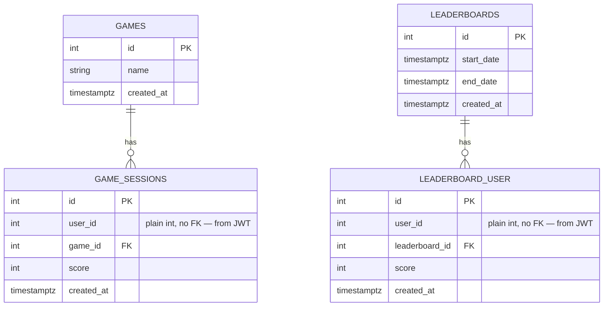

# Gamification Service — Database Design

## Overview

This service owns all gamification-related tables: games, game sessions, leaderboards, and leaderboard scores. It connects to its own PostgreSQL database, separate from the other services.

## Architecture Context

This is a microservice within a larger language-learning app. The relevant services are:

| Service                  | Language         | Tables it owns                                                       |
|--------------------------|------------------|----------------------------------------------------------------------|
| auth-service             | Python (FastAPI) | `users`, `languages`                                                 |
| core-service             | Python (FastAPI) | `phrases`, `review_data`, `review_sessions`, `review_session_phrase` |
| **gamification-service** | **Java**         | **`games`, `game_sessions`, `leaderboards`, `leaderboard_user`**     |

### Cross-service communication

- **`user_id`** appears in `game_sessions` and `leaderboard_user` as a plain integer — **no foreign key**. The `users` table lives in `auth-service`.
- The `user_id` is extracted from the **JWT** that comes with each request. The token is issued by `auth-service`.
- If you need user info (username, email, etc.), call `auth-service` via its REST API. Never query its database directly.

## ER Diagram (Mermaid)



## Schema SQL

```sql
CREATE TABLE games (
    id SERIAL PRIMARY KEY,
    name TEXT NOT NULL UNIQUE,
    created_at TIMESTAMPTZ NOT NULL DEFAULT NOW()
);

CREATE TABLE game_sessions (
    id SERIAL PRIMARY KEY,
    user_id INT NOT NULL ON DELETE RESTRICT,
    game_id INT NOT NULL REFERENCES games(id),
    score INT NOT NULL CHECK (score >= 0),
    created_at TIMESTAMPTZ NOT NULL DEFAULT NOW()
);

CREATE TABLE leaderboards (
    id SERIAL PRIMARY KEY,
    start_date TIMESTAMPTZ NOT NULL,
    end_date TIMESTAMPTZ NOT NULL,
    created_at TIMESTAMPTZ NOT NULL DEFAULT NOW()
);

CREATE TABLE leaderboard_user (
    id SERIAL PRIMARY KEY,
    user_id INT NOT NULL,
    leaderboard_id INT NOT NULL REFERENCES leaderboards(id) ON DELETE RESTRICT,
    score INT NOT NULL,
    created_at TIMESTAMPTZ NOT NULL DEFAULT NOW(),
    UNIQUE(user_id, leaderboard_id)
);

CREATE INDEX idx_game_sessions_user_id ON game_sessions(user_id);
```

## Conventions

Follow these across all tables:

- **Naming**: `snake_case` for tables and columns
- **Dates**: Always `TIMESTAMPTZ` (stored in UTC, frontend converts to local)
- **`created_at`**: Present on every table, `NOT NULL DEFAULT NOW()`
- **Soft delete**: Users are never deleted, only marked as `active = false` in `auth-service`. This is why `user_id` columns use `ON DELETE RESTRICT` where applicable
- **Constraints**: Be explicit with `NOT NULL`, `CHECK`, `UNIQUE`, and `DEFAULT`
- **Indexes**: PostgreSQL does not auto-create indexes on foreign keys — add them manually

## Migrations

Use **Flyway** or **Liquibase** for schema versioning (the Java equivalents of Alembic). Each migration should have an up and down script.

Suggested migration order:

1. `V1__create_games.sql`
2. `V2__create_game_sessions.sql`
3. `V3__create_leaderboards.sql`
4. `V4__create_leaderboard_user.sql`
